# Minimal

este es un software desarollado completamente en lenguaje BASH
el cual intenta "ENSAMBLAR" un sistema linux MINIMO

su uso es el siguiente:
el archivo sasaga.sh contiene todo el codigo fuente para la creacion del sistema linux minimalista basta solo con ejecutarlo

cd carpeta_proyecto
sudo ./sasaga.sh

se generara una imagen ISO al final de la ccompilacion y ya pueden tener la base de un sistema linux minimalista, ¿listo para empezar armar el suyo completamente desde cero?

pudes colaborar a que siga creando nuevas herramientas con una donacion en Paypal al correo ssanchezga@ufpso.edu.co

Breve galeria de su compilacion

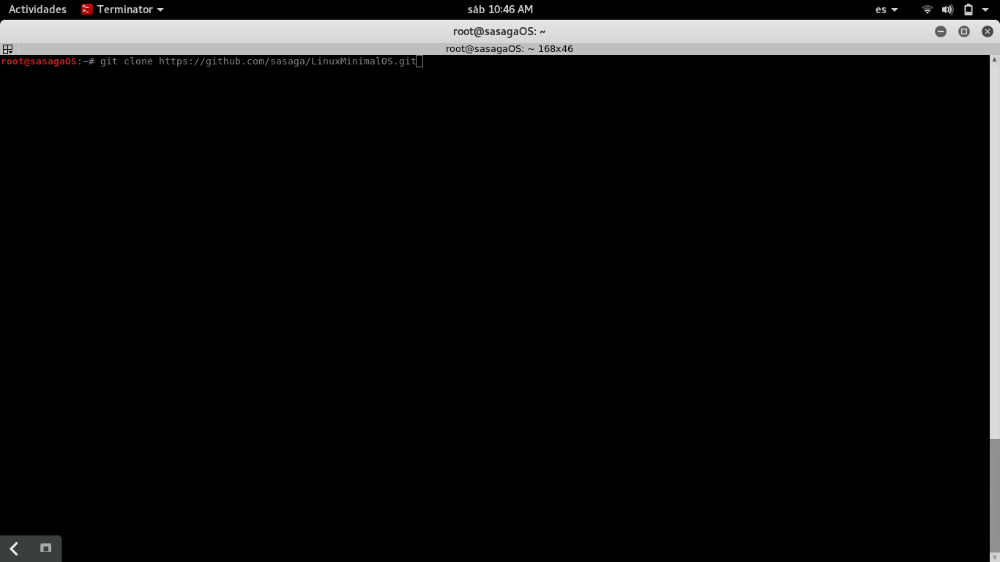
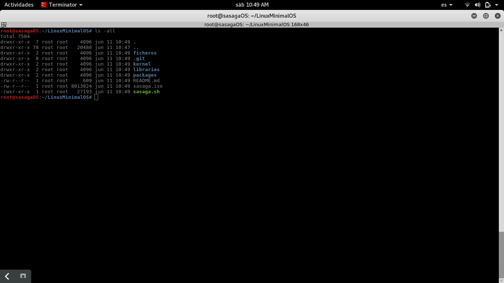
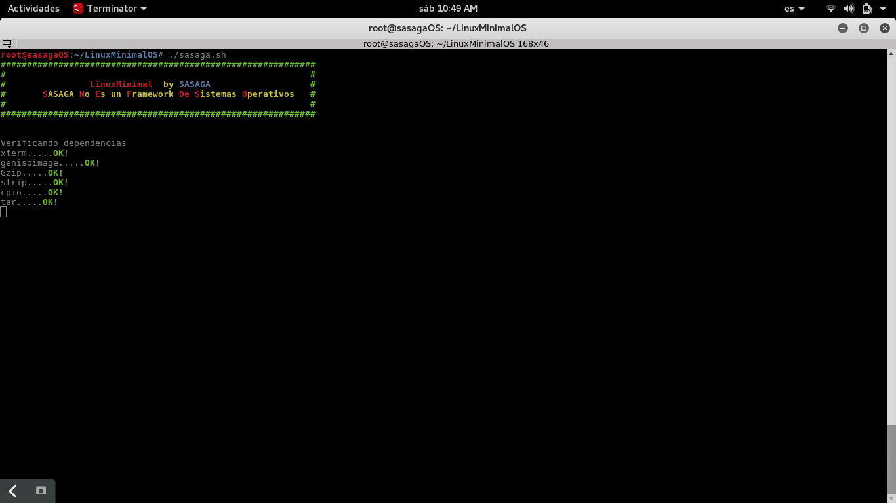
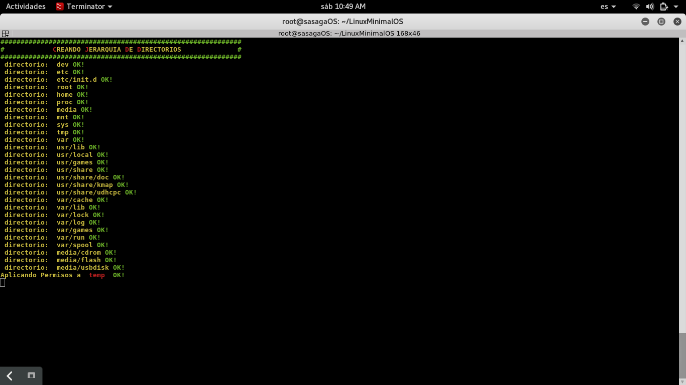
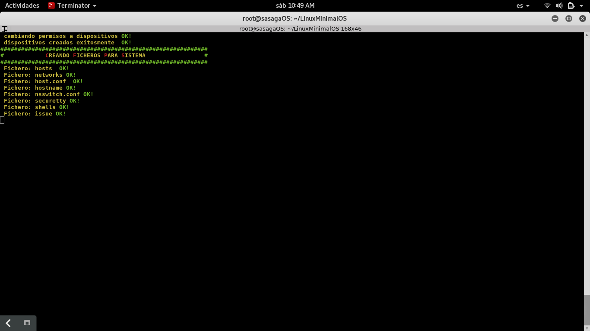
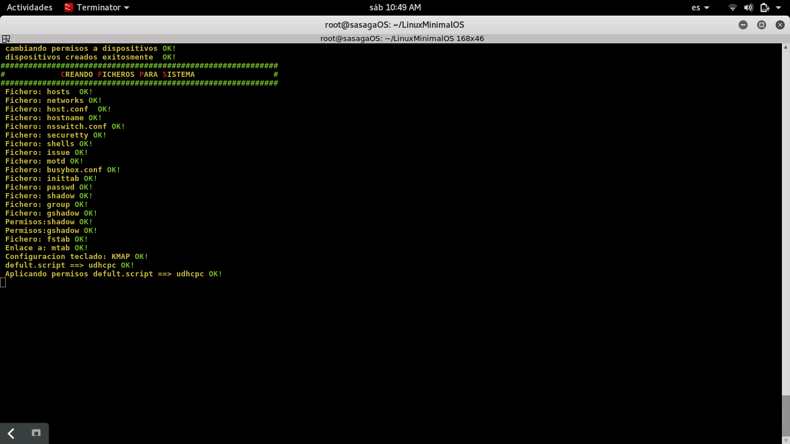
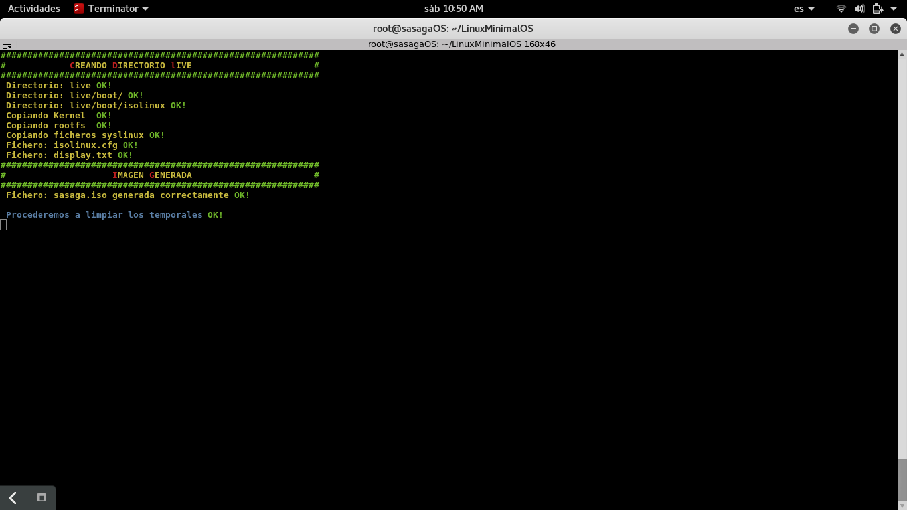
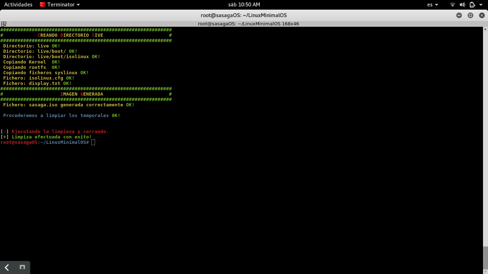
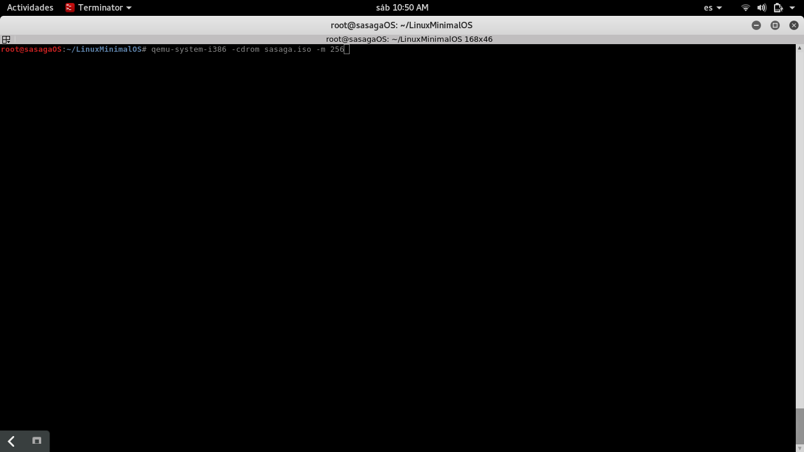
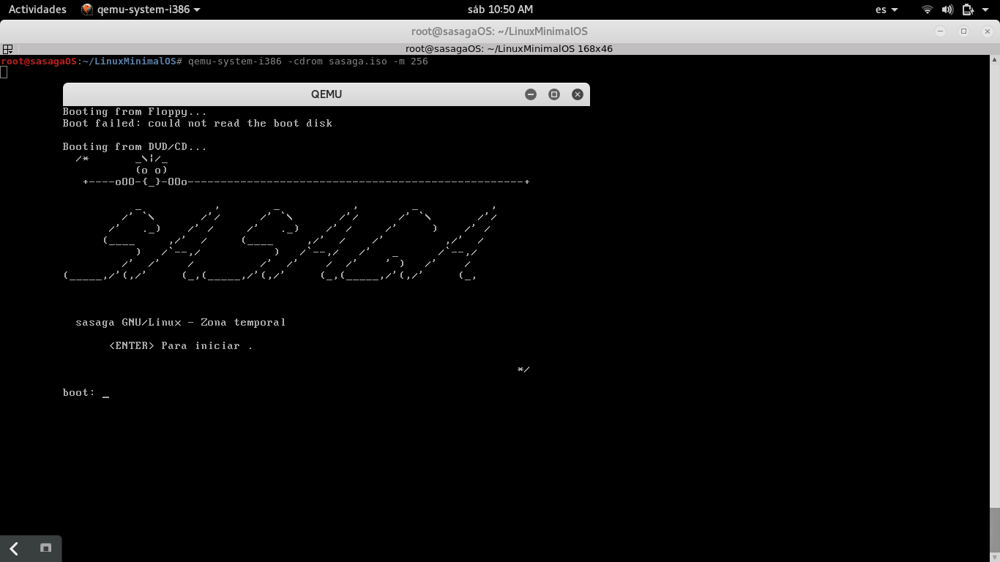
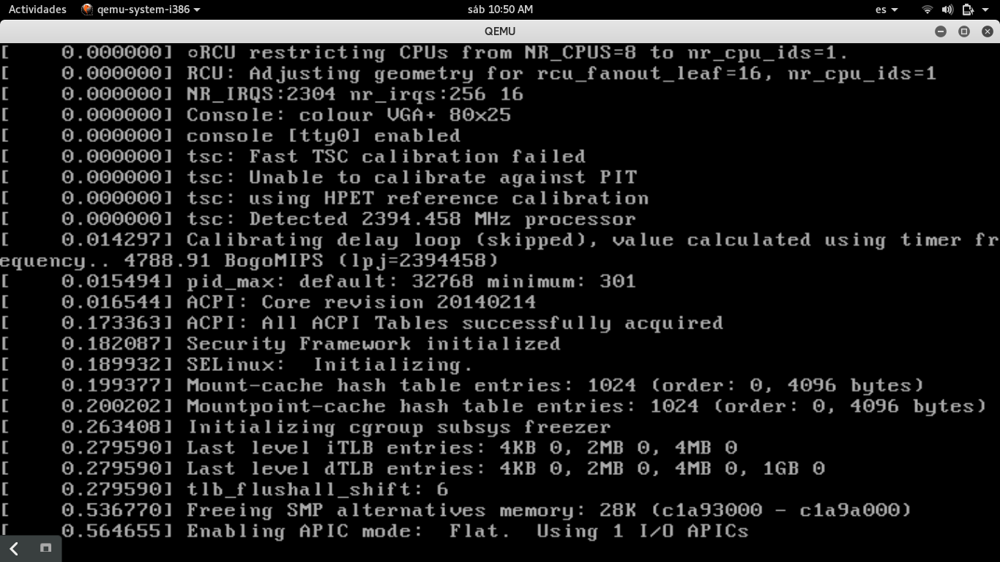
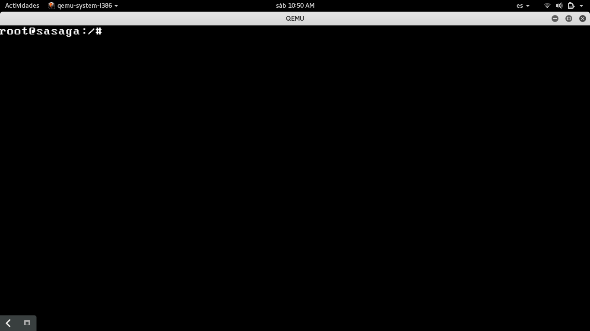
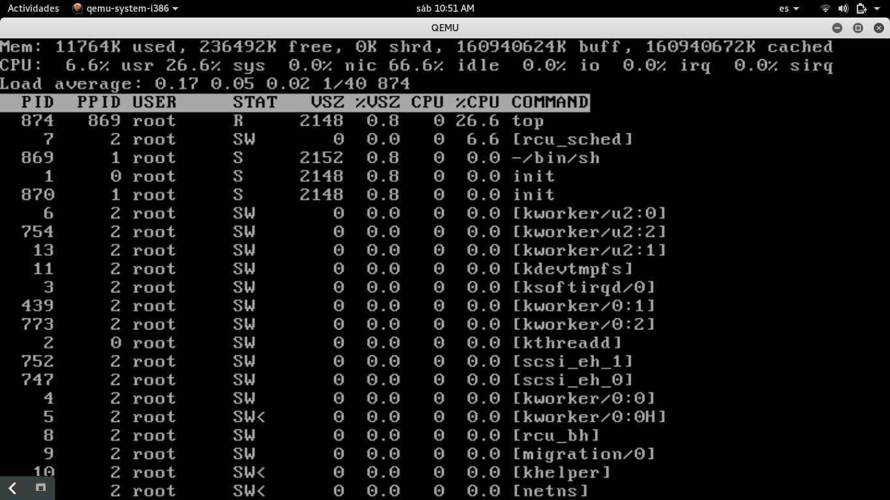
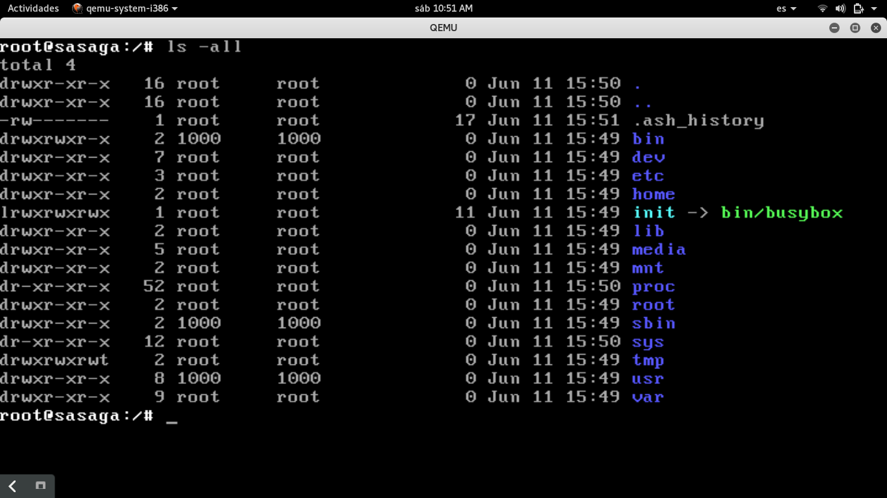
